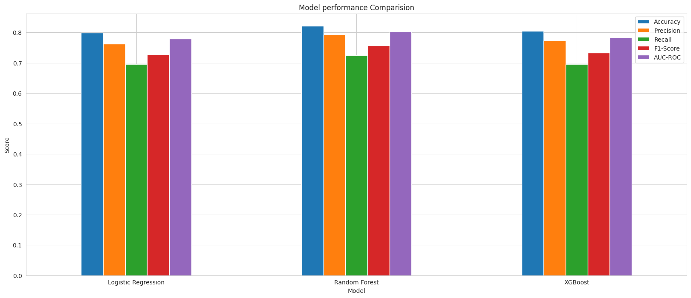

# Titanic Survival Prediction

A data science project to analyze the factors that influenced survival on the Titanic and build a machine learning model to predict passenger survival.



---

### **Table of Contents**
* [Project Goal](#project-goal)
* [Workflow](#workflow)
* [Key Findings](#key-findings)
* [Model Performance](#model-performance)
* [Technology Stack](#technology-stack)
* [How to Run This Project](#how-to-run-this-project)

---

### **Project Goal**
The objective of this project is to perform a complete data science workflow to predict whether a passenger on the Titanic survived. This involves:
- **Exploratory Data Analysis (EDA):** To understand the dataset and uncover initial insights.
- **Data Cleaning and Feature Engineering:** To prepare the data for modeling.
- **Machine Learning Modeling:** To train and evaluate multiple classification models.
- **Conclusion:** To provide a summary of findings and recommend the best model.

---

### **Workflow**
The project follows a structured data science workflow:
1.  **Exploratory Data Analysis:** Inspected the data for shape, types, null values, and statistical summaries. Found significant missing data in `Age` and `Cabin`.
2.  **Visual Analysis:** Used `seaborn` and `matplotlib` to visualize relationships. Key discoveries include the strong correlation between `Sex`/`Pclass` and `Survived`.
3.  **Data Cleaning & Feature Engineering:**
    - Handled missing values by imputing `Age` with the median and `Embarked` with the mode. Dropped the `Cabin` column.
    - Engineered new features like `FamilySize` and `IsAlone` to capture more information.
    - Encoded categorical variables (`Sex`, `Embarked`) into a numerical format using mapping and one-hot encoding.
4.  **Model Building & Evaluation:**
    - Trained three different models: Logistic Regression, Random Forest, and XGBoost.
    - Evaluated models using Accuracy, Precision, Recall, F1-Score, and AUC.
5.  **Model Comparison:** Compared the performance of all models to select the best one for this task.

---

### **Key Findings**
- **Gender is the strongest predictor:** Females had a significantly higher chance of survival (~74%) compared to males (~19%).
- **Social class matters:** First-class passengers had a much higher survival rate (63%) than third-class passengers (24%).
- **Traveling alone was dangerous:** Passengers traveling alone had a lower survival rate than those in small families.

---

### **Model Performance**
The models were evaluated on the test set. XGBoost emerged as the top-performing model.

| Model               | Accuracy | F1-Score | AUC-ROC |
|---------------------|----------|----------|---------|
| Logistic Regression | 0.7989   | 0.7273   | 0.7796  |
| Random Forest       | **0.8212**   | **0.7576**   | **0.8032**  |
| **XGBoost**         | 0.8045   | 0.7328   | 0.7842  |


---

### **Technology Stack**
- **Python**
- **Pandas:** For data manipulation and analysis.
- **NumPy:** For numerical operations.
- **Matplotlib & Seaborn:** For data visualization.
- **Scikit-learn:** For data preprocessing and classical machine learning models.
- **XGBoost:** For the high-performance gradient boosting model.
- **Google Colab:** As the main environment for analysis.

---

### **How to Run This Project**
1.  **Clone the repository:**
    ```bash
    git clone https://github.com/Samarth-3910/Predict-Survival-on-the-Titanic
    cd Predict-Survival-on-the-Titanic
    ```
2.  **Create and activate a virtual environment:**
    ```bash
    python -m venv venv
    source venv/bin/activate  # On Windows: venv\Scripts\activate
    ```
3.  **Install the required dependencies:**
    ```bash
    pip install -r requirements.txt
    ```
4.  **Run the Jupyter Notebook:**
    ```bash
    jupyter notebook notebooks/predict_survival_on_the_titanic.ipynb
    ```
